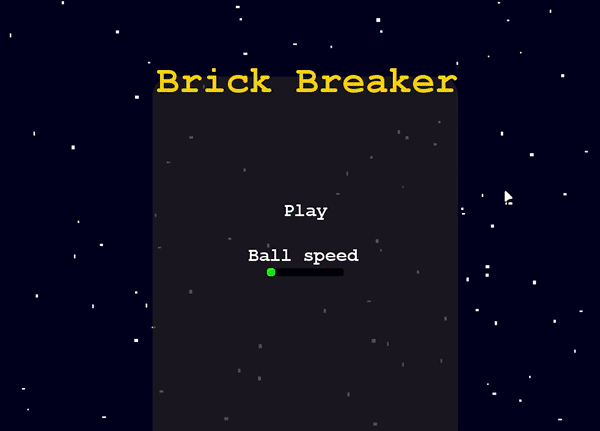

# Brick Breaker

Brick breaker game implemented in Java using the Swing library.



## Building
You can build up this project using maven or just using Java.

- Requirements
    - Java 21
    - Maven 3.6.3 (Optional)

#### Java
````shell
javac -sourcepath src/main/java/ src/main/java/io/github/cuisse/bricker/Application.java -d target/
jar cfe bricker.jar io.github.cuisse.bricker.Application -C target/ .
````

#### Maven
````shell
mvn clean package
````

## Running

#### Java
````shell
java -jar bricker.jar
````
#### Maven
````shell
mvn exec:java -D"exec.mainClass"="io.github.cuisse.bricker.Application"
````